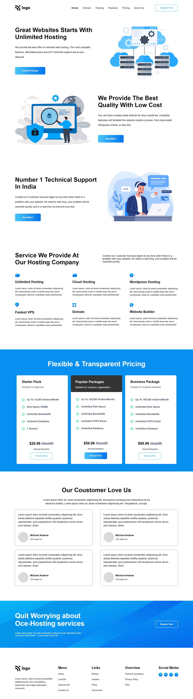

# UI Project 11 - Hosting Company Website

> ### **Deployed Website** :-[Live Link](https://ui-project-11.netlify.app/)
 

## Project key takeaways:

  - Used Only **Html** and **CSS**
  - I used flexbox and media queries to make the section mobile responsive.
  - I learned a lot about flexbox and flex-wrap.
  - I Learned about gradient colors.

   

 

> ## It took around 8 hours to complete and make this project **Mobile** Responsive.
